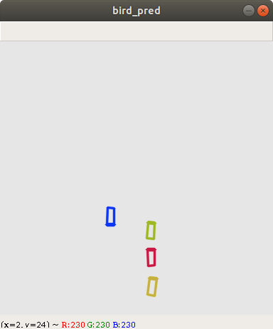

# CenterNet Object Tracking
This project is used to implement the KITTI object detection and tracking system using a pretrained [CenterNet](https://github.com/xingyizhou/CenterNet) model.

# How to run
Firstly, [download](http://www.cvlibs.net/datasets/kitti/eval_tracking.php) the KITTI left images and labels to evaluate the model.

Secondly, download the pretrained [ddd_3dop.pth](https://drive.google.com/file/d/1LrAzVJqlZECVuyr_NJI_4xd88mA1fL5b) model.

Finally, follow [these steps](https://github.com/xingyizhou/CenterNet/blob/master/readme/INSTALL.md) for installation.

If you have some issues with torch - torchvision compatibility, try this:
~~~
sudo pip3 install -r requirements.txt
~~~

To predict and track objects from KITTI, use:
~~~
python3 predict.py [--dataset_type] [--model_name] [--score_threshold] [--dist_threshold] [--iou_threshold] [--depth_threshold] [--check_zmin] [--check_dim_ratio] [--ttl] [--begin_index] [--end_index] [--show_frames/no_show_frames] [--verbose/no_verbose] [--with_keys/with_no_keys]
~~~
To show already predicted objects, use:
~~~
python3 parse.py [--dataset_type] [--index] [--is_gt]
~~~
# Examples
Screenshots were taken from the first image of 0001 training dataset.
Raw 2D bounding boxes:

Tracked 3D bounding boxes:

Bird-view bounding boxes:

# Results
Unfortunately, this model can't be evaluated on the testing KITTI dataset due to its policy. So, only training dataset's results are published.

|Class|MOTA|MOTP|MT|ML|IDS|FRAG|
|-----|----|----|--|--|---|----|
|Car|79.90%|80.22%|70.92%|6.91%|165|539|
|Pedestrian|52.26%|69.23%|39.52%|11.97%|490|915|
